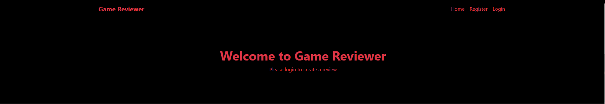
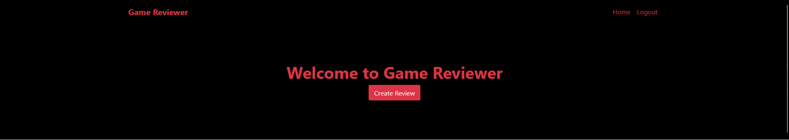
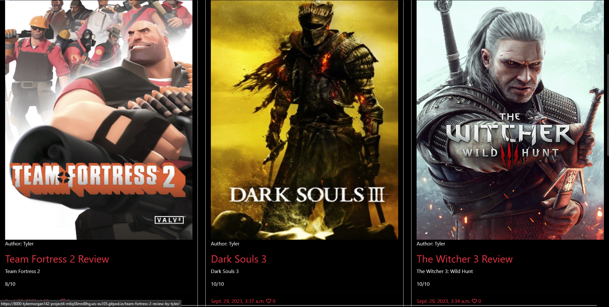
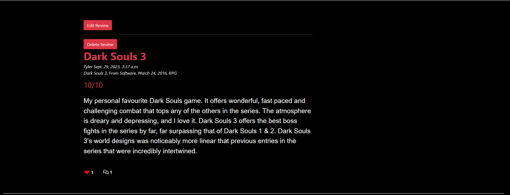
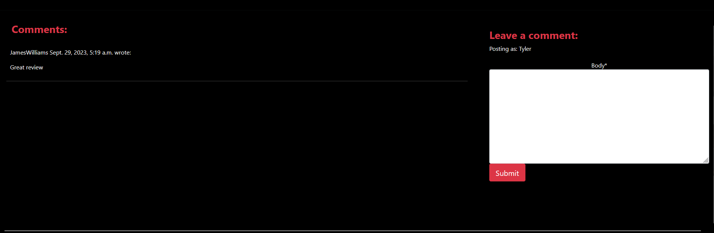
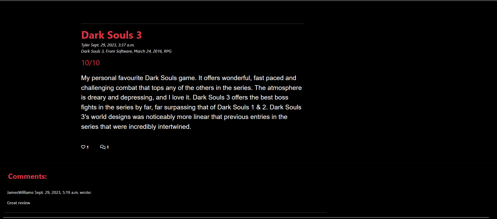

# Game Reviewer

## UX

### User Stories
#### Completed
- As a Site User I can create, read, update and delete reviews so that I can manage the content I post

- As a Site User I can view a paginated list of reviews so that I can select which review I want to look at

- As a Site User I can register for an account so that make my own reviews and interact with others people's

- As a Site User I can view a list of reviews so that I can select one to read

- As a Site User I can open up a review so that I can read the whole thing

- As a Site User I can give games a rating on a scale of 1-10 so that I can easily convey my opinion on a game

- As a Site User / Admin I can view the number of likes on each review so that I can see which reviews people tend to agree or disagree with.

- As a Site User / Admin I can view comments on an individual post so that I can read the conversation.

- As a Site User I can leave comments on a review so that I can be involved in the conversation

- As a Site User I can like or unlike a post so that I can interact with the content

#### Uncompleted

- As a Site User I can search for reviews from a specific developer so that I can see how other games judge the quality of the developer's games

- As a Site User I can filter games by genre so that I can view reviews for genres of games that I am interested in

- As a Site User I can view a list of games with the highest average ratings so that see what games most people rate highly

- As a Site User I can search for reviews of a specific game so that I can find reviews for a game I am considering buying

Game Reviewer is a site that aims to give people a place to review their favourite video games. The site is targeted towards gamers who wants to leave reviews for games that they have played or read up on reviews for games they are considering playing.

## Features

### Existing Features

The site features a fully functioning responsive navigation bar that includes a hlogo, a home button, login/logout and signtup functionality depending on whether the user is signed in or not.

Right under the nav-bar is the header displaying the sites name and if the user is logged in, a button to start making a review. If they are not logged in they are instead met with a message asking them to login to create a review

When a user clicks the create review button, they are bought to a form to fill in the details of their review.

Under the header is the paginated list of posted reviews each containing of image of their respective game, the author of the review, the title of the review, the game the review is about, the rating awarded from the reviewer, the date and time the review was published and a like counter.

The bottom of the page features button to take the user to the next page of the site

If the user clicks on one of the reviews they are taken to a page containing the detail of the review. If the user is looking at their own review, this page features edit/delete buttons. There is also a like button, that displays how many likes the review has and a display for how many comments.

On this page is also the comments section and the form for users to leave comments on the post if they are logged in.

#### 