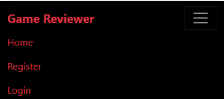

# Game Reviewer

## UX

### User Stories
#### Completed
- As a Site User I can create, read, update and delete reviews so that I can manage the content I post

- As a Site User I can view a paginated list of reviews so that I can select which review I want to look at

- As a Site User I can register for an account so that make my own reviews and interact with others people's

- As a Site User I can open up a review so that I can read the whole thing

- As a Site User I can give games a rating on a scale of 1-10 so that I can easily convey my opinion on a game

- As a Site User / Admin I can view the number of likes on each review so that I can see which reviews people tend to agree or disagree with.

- As a Site User / Admin I can view comments on an individual post so that I can read the conversation.

- As a Site User I can leave comments on a review so that I can be involved in the conversation

- As a Site User I can like or unlike a post so that I can interact with the content

#### Uncompleted

- As a Site User I can search for reviews from a specific developer so that I can see how other games judge the quality of the developer's games

- As a Site User I can filter games by genre so that I can view reviews for genres of games that I am interested in

- As a Site User I can view a list of games with the highest average ratings so that see what games most people rate highly

- As a Site User I can search for reviews of a specific game so that I can find reviews for a game I am considering buying

Game Reviewer is a site that aims to give people a place to review their favourite video games. The site is targeted towards gamers who wants to leave reviews for games that they have played or read up on reviews for games they are considering playing.

## Features

### Existing Features

The site features a fully functioning responsive navigation bar that includes a hlogo, a home button, login/logout and signtup functionality depending on whether the user is signed in or not.

Right under the nav-bar is the header displaying the sites name and if the user is logged in, a button to start making a review. If they are not logged in they are instead met with a message asking them to login to create a review

On smaller screens, the nav-bar becomes a burger menu

When a user clicks the create review button, they are bought to a form to fill in the details of their review.

Under the header is the paginated list of posted reviews each containing of image of their respective game, the author of the review, the title of the review, the game the review is about, the rating awarded from the reviewer, the date and time the review was published and a like counter.

The bottom of the page features button to take the user to the next page of the site

If the user clicks on one of the reviews they are taken to a page containing the detail of the review. If the user is looking at their own review, this page features edit/delete buttons. There is also a like button, that displays how many likes the review has and a display for how many comments.

On this page is also the comments section and the form for users to leave comments on the post if they are logged in.

### Features not yet implemented

- Give users the ability to search for a specific game

- Give users the ability to filter games by genre

- Give users the ability to search for games by as specific developer

- Give users the ability to search games by their average ratings

# Testing

## Code Validation

### HTML
All html code passed the [W3C validator](https://validator.w3.org/) with the exception of a stray end div tag that I cannot find.
### CSS
All css code passed the [W3C validator](https://jigsaw.w3.org/css-validator/#validate_by_input)

### Python
Other than some line too long errors in various files, all code passes through the [Code Institute PEP8 Validator](https://pep8ci.herokuapp.com/) without any issues.

### Javascript
All JS code passes the [JS code tester](https://jshint.com/)

## Responsiveness

All pages have shown to be responsive on larger and smaller screens

## Manual User Stories Testing

- As a Site User I can create, read, update and delete reviews so that I can manage the content I post

A logged in site user is capable of performing all CRUD functionalities on their reviews

- As a Site User I can view a paginated list of reviews so that I can select which review I want to look at

A site user can view a paginated list of reviews on the home page

- As a Site User I can register for an account so that make my own reviews and interact with others people's

A site user is capable of registering for an account with the register button in the navigation bar, this allows them to make their own reviews and interact with other people's in the form of comments and likes

- As a Site User I can open up a review so that I can read the whole thing

A site user is capable of opening up a review to view the details of said review by clicking anywhere on the image or title for the review

- As a Site User I can give games a rating on a scale of 1-10 so that I can easily convey my opinion on a game

A site user is capable of giving a rating on a scale of 1-10 when creating their reviews via use of the form

- As a Site User / Admin I can view the number of likes on each review so that I can see which reviews people tend to agree or disagree with.

A site user is capable of viewing the number of likes on a review indicated by the numbere next to the heart icon present on all reviews on the home page and in their details pages

- As a Site User / Admin I can view comments on an individual post so that I can read the conversation.

A site user is capable of viewing all comments left on a post via opening up said review

- As a Site User I can leave comments on a review so that I can be involved in the conversation

A site user that is logged in is capable of leaving a comment on a review

- As a Site User I can like or unlike a post so that I can interact with the content

A site user is capable of liking and unliking posts by clicking the heart icon when they open up a review

# Bugs

## Solved Bugs

I had a problem with review posts not being assigned a slug unless they were made within the admin panel. Code taken from [here](https://www.geeksforgeeks.org/overriding-the-save-method-django-models/) fixed this issue

# Deployment

This project was deployed to Heroku at [this location](https://game-reviewer-project-335afd7f7340.herokuapp.com/?page=1)

 The steps for deployment are as follows:

1 Sign up for Heroku

2 Go to the dashboard and create a new app

3 Give the app a name and assign it a region, then click "create app".

4 In the settings page give the app a config var with a key of "PORT" and a value of "8000". This project also includes CLOUDINARY_URL, DATABASE_URL, HEROKU_POSTGRESQL_IVORY_URL, and SECRET_KEY

5 Still in settings add the Python buildpack

6 In the deployment page, the app is connected to my github account and repository.

This app automatically deploys itself when any new code is pushed to Github.